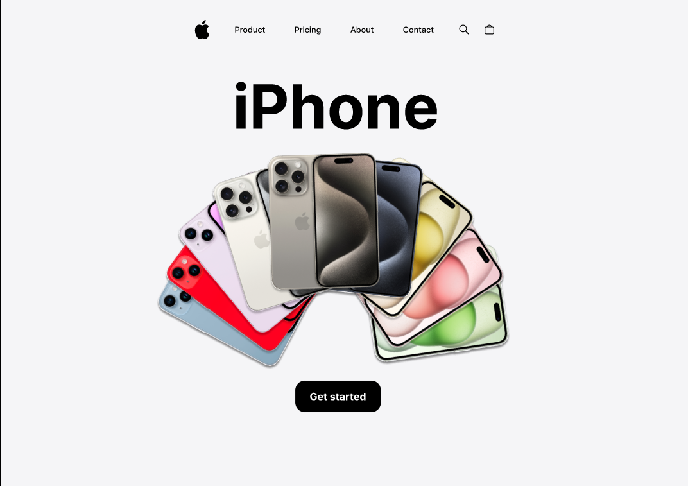
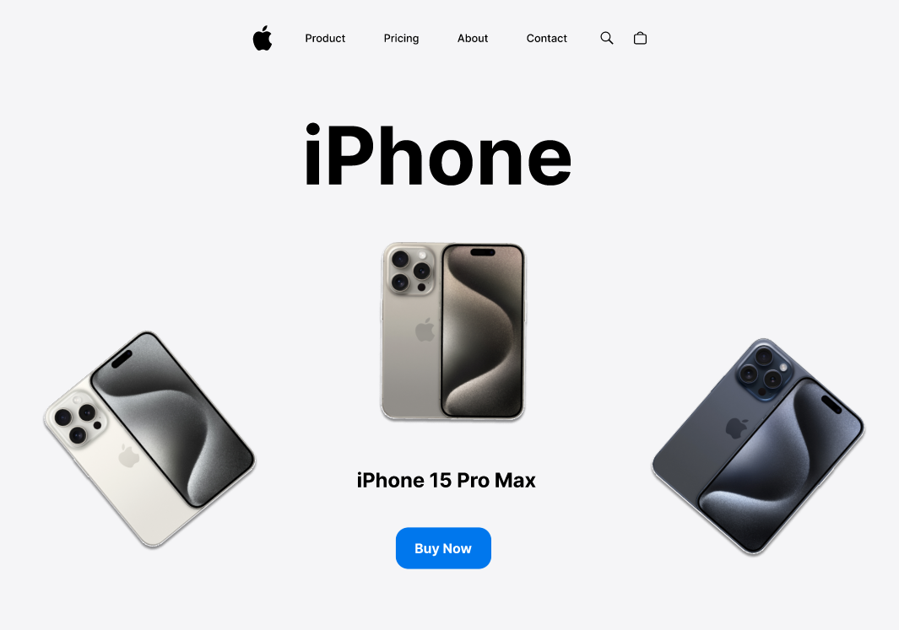
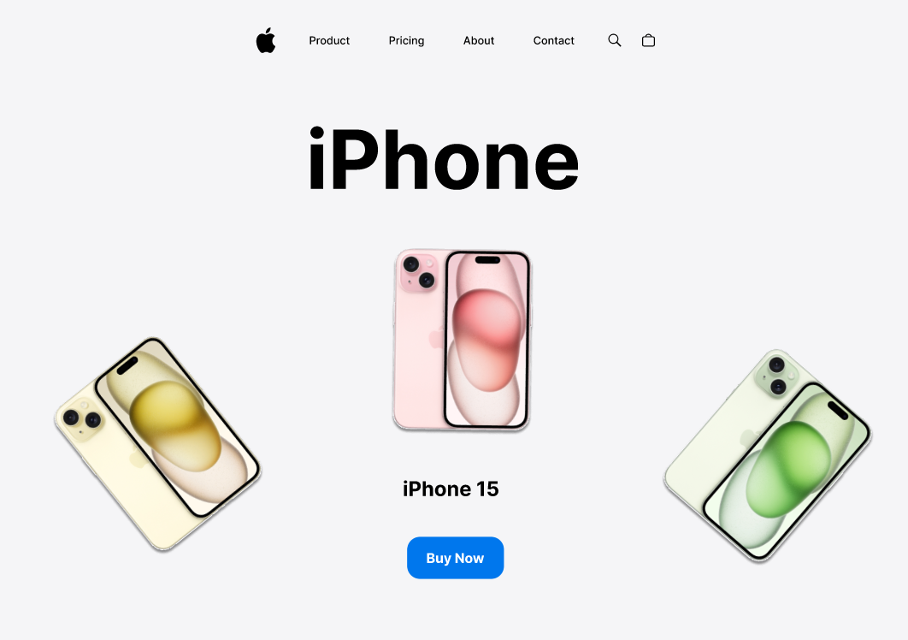
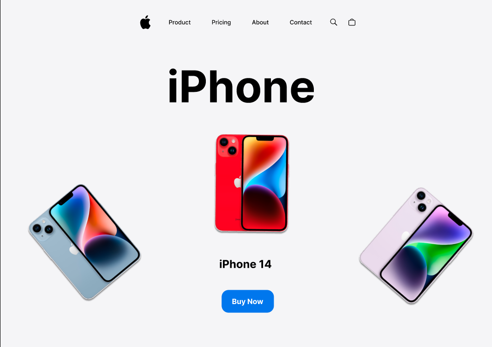

# What is Figma?
Figma is a powerful tool that lets us design and prototype web apps before we develop them.

## Project iPhone 📱
A design prototype inspired by apple products, I made a dynamic website 

## The Goal 🎯

[Run this website in Figma](https://www.figma.com/file/Zbls2C0U6gdxUMODrQlBhn/projeto-iPhone?type=design&node-id=9%3A1852&mode=design&t=ArqNZx6vT44pAgPJ-1)

## How the project was done
The project was made using SVG and images, animations contained in figma itself, and some plugins that I will be making available

### Useful Figma plugins

[Unsplash](https://www.figma.com/community/plugin/738454987945972471/unsplash?searchSessionId=lukbta3a-st22o6azdvc)  
[Content Reel](https://www.figma.com/community/plugin/731627216655469013/content-reel?searchSessionId=lukbxhfn-ppprrax1gsn)
